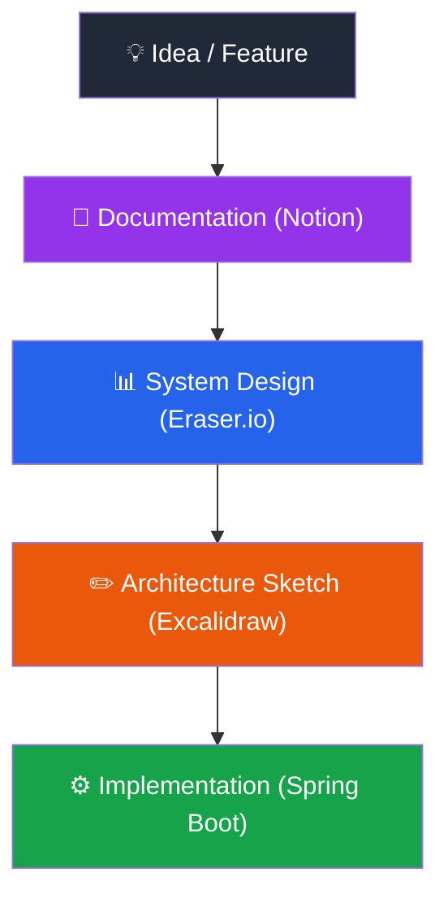

<h1 align="center">
  
</h1>

---

### 🛠️ Tech Stack

<p align="center">
  
  
  
  
  
  <br>
  
  
  
  <br>
  
  
  
  
  
  
</p>

---


### 👨‍💻 About Me

- 🌱 Currently deep-diving into **Spring Boot Microservices**
- 📱 Building **Android apps with Jetpack Compose**
- 🧠 Focused on **DSA & System Design**
- 🚀 Passionate about **scalable backend systems**
- 📫 Reach me: **mahir2019205@gmail.com**

<br clear="right"/>

---

### 💻 Featured Projects

<table border="0" width="100%">
  <tr>
    <td width="50%" valign="top">
      <h4>💸 <a href="https://github.com/Mahir-Agarwal/GroupPay-Backend">GroupPay-Backend</a></h4>
      <p>A high-performance REST API engineered to simplify complex group finances. It utilizes a <b>Greedy "Minimum Cash Flow" Algorithm</b> to solve the NP-hard problem of debt simplification and minimize transactions. Built with <b>Java, Spring Boot, JWT Auth, and Docker</b>.</p>
    </td>
    <td width="50%" valign="top">
      <h4>🔌 <a href="https://github.com/Mahir-Agarwal/ConnectX-ServerSide">ConnectX-ServerSide</a></h4>
      <p>A scalable backend architecture designed to power seamless client-server interactions. Engineered to handle secure user management, robust routing, and efficient data processing using domain-driven design principles.</p>
    </td>
  </tr>
</table>


---
## 📐 Engineering Workflow



I document system ideas and requirements using **Notion**,  
design system architectures with **Eraser.io**,  
and sketch architecture flows visually using **Excalidraw** before implementation.

---

### 📄 Resume

📥 **[Download my Resume Here](https://drive.google.com/file/d/1IVo_mZXLEEWX01o6GtrXP3K2bnEncs0r/view?usp=sharing)**

---

### 🖥️ Developer Terminal

```bash
mahir@backend-server:~$ whoami
Mahir Aggarwal

mahir@backend-server:~$ cat role.txt
Full Stack Java Developer

mahir@backend-server:~$ ls tech-stack/
java spring-boot android jetpack-compose redis docker mysql

mahir@backend-server:~$ cat backend_skills.txt
Microservices Architecture & RESTful API Design
WebSocket Communication & JWT Authentication
API Gateway & Service Discovery
Dockerized Deployments

mahir@backend-server:~$ ./run_current_focus.sh
> Architecting scalable microservices
> Optimizing DSA problem-solving

mahir@backend-server:~$ uptime
Coding, building, and scaling systems consistently.
```

---

### 📊 LeetCode

<div align="center">


</div>


---

### 🌐 Let's Connect

<p align="center">
  <a href="https://www.leetcode.com/mahir_aggarwal">
    
  </a>
  <a href="mailto:mahir2019205@gmail.com">
    
  </a>
</p>

<div align="center">
  <sub>Engineered and Developed by <a href="https://github.com/Mahir-Agarwal">Mahir Aggarwal</a></sub>
</div>
